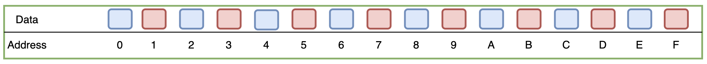
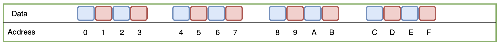
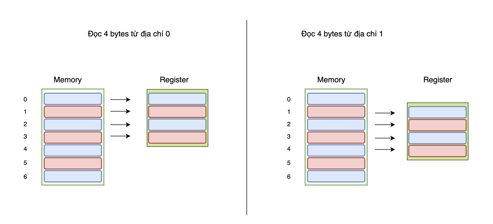
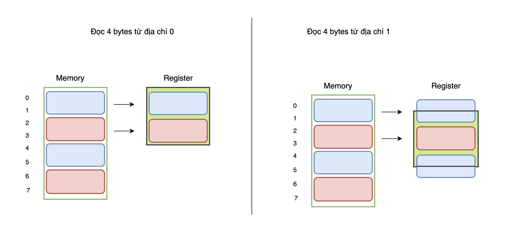
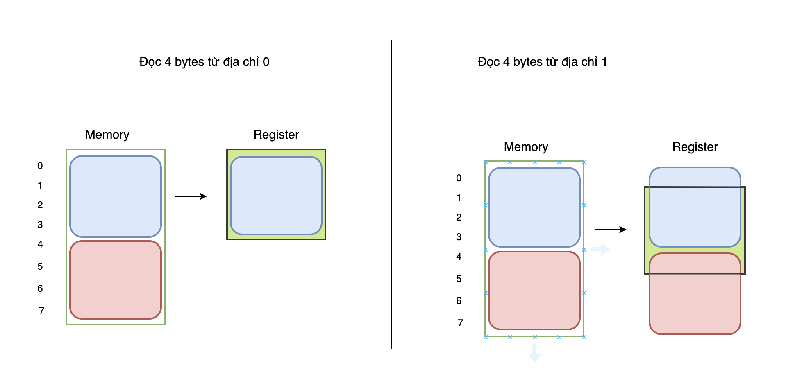
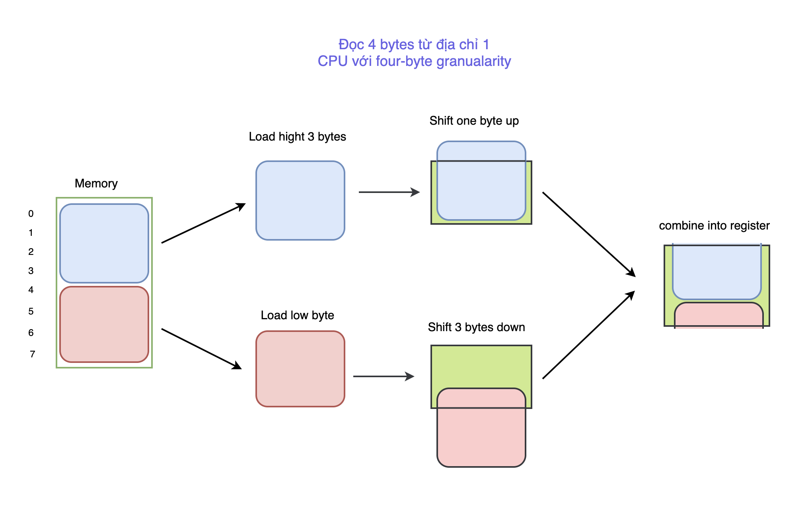
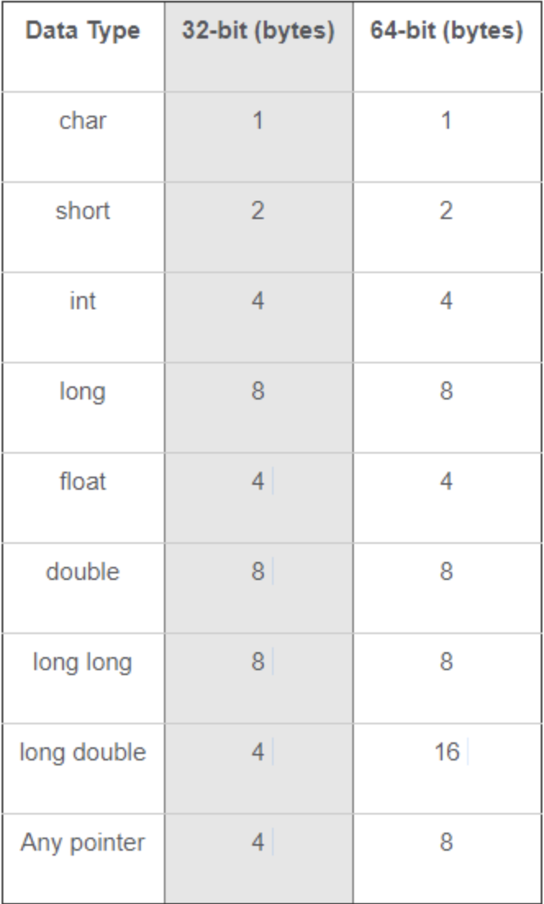
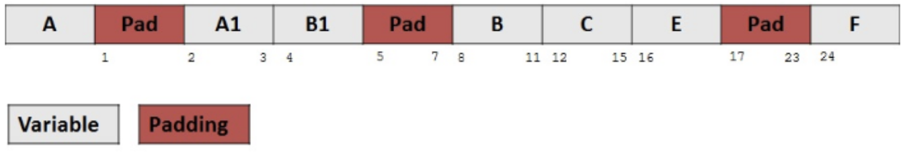
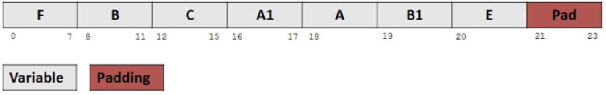

### data structure alignment.
#### -> concept of padding and alignment.

- Đối với class và struct thì việc cấp phát và tổ chức bộ nhớ có sự khác biệt với cách cấp phát đối với các biến thông thường như int, float, ... vấn đề này được gọi là Data Alignment. Trong bài viết này tôi giải thích lý do tồn tại khái niệm Data Alignment.
### Memory access granualarity
- Khi lập trình, chúng ta thường thấy bộ nhớ là một chuỗi các ô nhớ liên tiếp nhau, mỗi ô nhớ tương đương với 1 byte. 
- Tuy nhiên, đối với hệ thống máy tính, việc đọc và ghi với từng ô nhớ như vậy tốn nhiều thời gian dẫn tới việc giảm hiệu suất. Vì vậy, tại mỗi thời điểm, processor truy cập bộ nhớ với 2-, 4-, 8-, 16- và thậm chí 32- byte tùy vào từng hệ thống. Kích thước khi một process truy cập bộ nhớ được gọi là bộ nhớ truy cập chi tiết (Memory access granularity).
- Chúng ta có thể coi bộ nhớ đơn giản chỉ là một mảng các bytes xếp liên tiếp nhau như sau


<span style="color:#6c5ce7;">Hình 1 – Bộ nhớ dưới con mắt của lập trình viên</span>

- Tuy nhiên, trên thực tế thì CPU không đọc dữ liệu (từ memory) hay ghi dữ liệu (vào memory) theo từng byte. Thay vào đó nó truy cập vào memory theo từng block một, kích thước của mỗi block có thể là 2, 4, 8, 16 hoặc 32 bytes. Kích thước của mỗi block được gọi là “memory access granularity” của CPU. Những địa chỉ là vị trí bắt đầu của một block (có giá trị chia hết cho kích thước của một block) được goi là “aligned address”. Những địa chỉ không nằm ở vị trí bắt đầu của một block (có giá trị không chia hết cho kích thước của một block) được gọi là “unaligned address”. Ví dụ: với một CPU đọc dữ liệu từ memory theo block 4 bytes thì các địa chỉ 0, 4, 8 là aligned address; các địa chỉ 1, 2, 3 là unaligned address.


<span style="color:#6c5ce7;">Hình 2 – Bộ nhớ dưới con mắt của CPU</span>

Nếu bạn không hiểu và xử lý các vấn đề liên quan đến căn chỉnh dữ liệu (data alignment) trong khi viết chương trình thì chương trình của bạn có thể sẽ gặp phải các vấn đề sau (sắp xếp theo độ nghiêm trọng tăng dần) →

    -> Chương trình chạy chậm hơn.

    -> Chương trình bị treo.

    -> Hệ điều hành sụp đổ (crash).

    -> Chương trình âm thầm chạy sai logic và gây ra hậu quả nghiêm trọng.

### Nguyên tắc căn bản của Data Alignment

Để minh họa các nguyên tắc trong alignment, chúng ta cùng phân tích một nhiệm vụ, và xem nó bị ảnh hưởng bởi sự truy cập bộ nhớ của CPU như thế nào. Nhiệm vụ rất đơn giản: đầu tiên đọc 4 bytes từ địa chỉ 0 vào thanh ghi của CPU. Sau đó, đọc 4 bytes từ địa chỉ 1 vào cùng thanh ghi đó.

Đầu tiên hãy xem điều gì sẽ xảy ra trên một CPU có memory access granularity = 1 byte (Single-byte memory access granularity).


<span style="color:#6c5ce7;">Hình 3 – Single-byte memory access granularity</span>

Trong cả 2 trường hợp trên (đọc từ địa chỉ 0 và 1) thì CPU đều phải mất 4 lần truy cập vào memory. Giờ chúng ta hãy xem chuyện gì sẽ xảy ra trên một CPU với memory access granularity = 2 bytes (Double-byte memory access granularity). 


<span style="color:#6c5ce7;">Hình 4 – Double-byte memory access granularity</span>

Khi đọc từ địa chỉ 0, một CPU có 2 double-byte granularity chỉ cần 2 lần truy cập memory (bằng một nửa số lần truy cập memory so với CPU với single-byte granularity). Bởi vì mỗi lần truy cập memory đòi hỏi một thời gian xử lý nhất định nên việc giảm thiểu số lượng truy cập memory sẽ làm tăng hiệu năng (performance) của chương trình.

Tuy nhiên, hãy chú ý xem những gì xảy ra khi đọc 4 bytes từ địa chỉ 1. Bởi vì địa chỉ 1 là unaligned address nên CPU sẽ có nhiều việc phải làm hơn. Trong trường hợp này CPU sẽ phải truy cập memory 3 lần: đọc 2 bytes từ địa chỉ 0 (byte số 0 và byte số1), đọc tiếp 2 bytes từ địa chỉ 2 (byte số 3 và byte số 4), sau đó đọc 2 bytes từ địa chỉ 4 (byte số 4 và byte số 5) và sau đó phải thực hiện các phép toán để lấy ra 4 bytes cần thiết trong số 6 bytes đã đọc ra. Việc CPU phải truy cập bộ nhớ nhiều hơn sẽ làm chương trình hoạt động chậm hơn.

Cuối cùng, hãy kiểm tra xem điều gì sẽ xảy ra trên một CPU với memory access granularity = 4 bytes (Four-byte memory access granularity). 


<span style="color:#6c5ce7;">Hình 5 – Four-byte memory access granularity</span>

Một CPU với four-byte granularity có thể đọc 4 bytes từ địa chỉ 0 (aligned address) chỉ với một lần đọc từ memory nhưng cần 2 lần truy cập memory để đọc 4 bytes từ địa chỉ 1 (unaligned address). Đến đây bạn đã nắm được các nguyên tắc căn bản liên quan đến căn chỉnh dữ liệu – data alignment. Các phần bên dưới sẽ giải thích chi tiết hơn về xử lý của CPU và trình biên dịch liên quan đến các vấn đề trong data alignment.

### CPU xử lý như thế nào khi đọc dữ liệu từ “unaligned address” ?

Một CPU sẽ phải thực hiện một số thủ thuật khi đọc dữ liệu từ unaligned address. Bây giờ chúng ta sẽ đi vào phân tích chi tiết hơn.

Quay trở lại ví dụ về việc đọc 4 bytes từ địa chỉ 1 trên một CPU có four-byte granularity:


<span style="color:#6c5ce7;">Hình 6 – Đọc 4 bytes từ địa chỉ 1 trên một CPU có four-byte granularity</span>

CPU cần phải đọc một block (4 bytes) từ địa chỉ 0 và loại bỏ các byte “không mong muốn” trong đó. Sau đó, nó cần phải đọc block thứ hai từ địa chỉ 4 và cũng loại bỏ các byte “không mong muốn” trong đó. Cuối cùng, cả hai phần được tổng hợp lại thành 4 bytes cần đọc để đặt vào trong thanh ghi. Có khá nhiều việc cần làm. Tuy nhiên một số CPU không hỗ trợ làm tất cả những công việc đó cho chúng ta.

CPU 68000 là một bộ xử lý với double-byte granularity và nó thiếu các vi mạch xử lý cho việc đọc dữ liệu từ unaligned addresses. Khi gặp địa chỉ như vậy, CPU sẽ ném ra một ngoại lệ. Hệ điều hành Mac OS nguyên gốc sẽ yêu cầu người sử dụng khởi động lại máy khi gặp ngoại lệ này.

CPU đời sau của 680×0 series, chẳng hạn như 68020 đã thay đổi, nó sẽ thực hiện công việc cần thiết cho chúng ta để đọc dữ liệu từ unaligned addresses. Điều này giải thích tại sao một số phần mềm hoạt động được trên 68020 lại bị treo trên 68000.

Tất cả các CPU đều có một số lượng hạn chế các bóng bán dẫn để thực thi các công việc. Việc bổ sung tính năng hỗ trợ truy cập unaligned addresses sẽ làm thâm hụt vào “ngân sách bóng bán dẫn” này. Các bóng bán dẫn này có thể được sử dụng để làm cho các bộ phận khác của CPU hoạt động nhanh hơn hoặc bổ sung thêm chức năng mới.

### Data Structure Alignment trong golang

Để tránh cho CPU phải thực hiện thêm các xử lý khi truy cập unaligned addresses thì trình biện dịch C/C++ tự động thực hiện alignment data trong quá trình biên dịch, đảm bảo cho CPU luôn truy cập dữ liệu từ aligned addresses.

Mặc dù trình biên dịch thường phân bổ các thành phần dữ liệu riêng lẻ trên các địa chỉ đã được căn chỉnh, nhưng các cấu trúc dữ liệu (data structure) thường có nhiều phần tử dữ liệu thuộc các kiểu dữ liệu khác nhau với các giá trị căn chỉnh (alignment requirement) khác nhau. Trình biên dịch sẽ cố gắng duy trì việc căn chỉnh của các phần tử dữ liệu bằng cách chèn các ô nhớ không sử dụng giữa các phần tử. Kỹ thuật này được gọi là “Padding”. Ngoài ra, trình biện dịch cũng thực hiện căn chỉnh toàn bộ structure bằng cách bổ sung padding vào cuối của structure, kỹ thuật này gọi là “Tail Padding”. Điều này làm cho mỗi phần tử của một mảng các structure được căn chỉnh hợp lý.


<span style="color:#6c5ce7;">Hình 7 – Giá trị căn chỉnh của các kiểu dữ liệu</span>

Padding sẽ được chèn vào trong structure khi một phần tử của structure được theo sau bởi một phần tử khác có giá trị căn chỉnh lớn hơn hoặc ở phần cuối của structure. Padding sẽ được thêm vào để căn chỉnh vị trí của các phần tử dữ liệu theo nguyên tắc sau:

    -> Khoảng cách từ một phần tử dữ liệu trong structure đến đầu của structure (tính theo byte) phải chia hết cho giá trị căn chỉnh của phần tử dữ liệu đó. Ví dụ: một phần tử dữ liệu có kiểu int trong structure thì khoảng cách từ phần tử đó đến đầu structure phải chia hết cho 4.
    -> Kích thước của toàn bộ structure phải đảm bảo chia hết cho giá trị căn chỉnh lớn nhất trong structure đó.
Thay đổi thứ tự của các phần tử dữ liệu trong một structure có thể làm thay đổi lượng padding cần thiết để duy trì sự căn chỉnh. Ví dụ, nếu các phần tử được sắp xếp theo thứ tự giảm dần của giá trị căn chỉnh thì lượng padding cần thiết sẽ là ít nhất.

```
type example struct
{
    char a;
    short a1;
    char b1;
    float b;
    int c;
    char e;
    double f;
};
```
Kích thước thực tế của structure example là 32 bytes. Nó có 11 bytes padding như hình bên dưới:


Bây giờ xem tiếp structure example2 bên dưới →

```
type example2 struct
{
    double f;
    float b;
    int c;
    short a1;
    char a,b1,e;
};
```

Kích thước thực tế của example2 là 24 bytes. Structure này chỉ chứa 3 bytes padding ở cuối (xem hình bên dưới) và do đó tiết kiệm bộ nhớ hơn. Như vậy, chỉ đơn giản là sắp xếp lại các phần tử trong khai báo của structure có thể giúp tránh lãng phí bộ nhớ



-> reference source: https://cppdeveloper.com/c-nang-cao/data-alignment-trong-c-c/