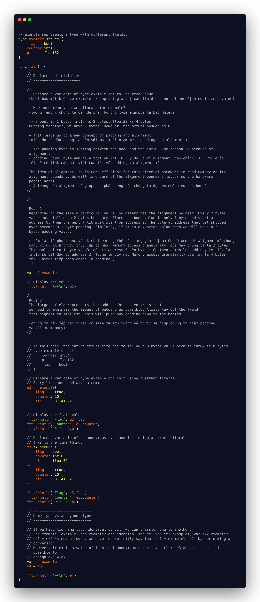
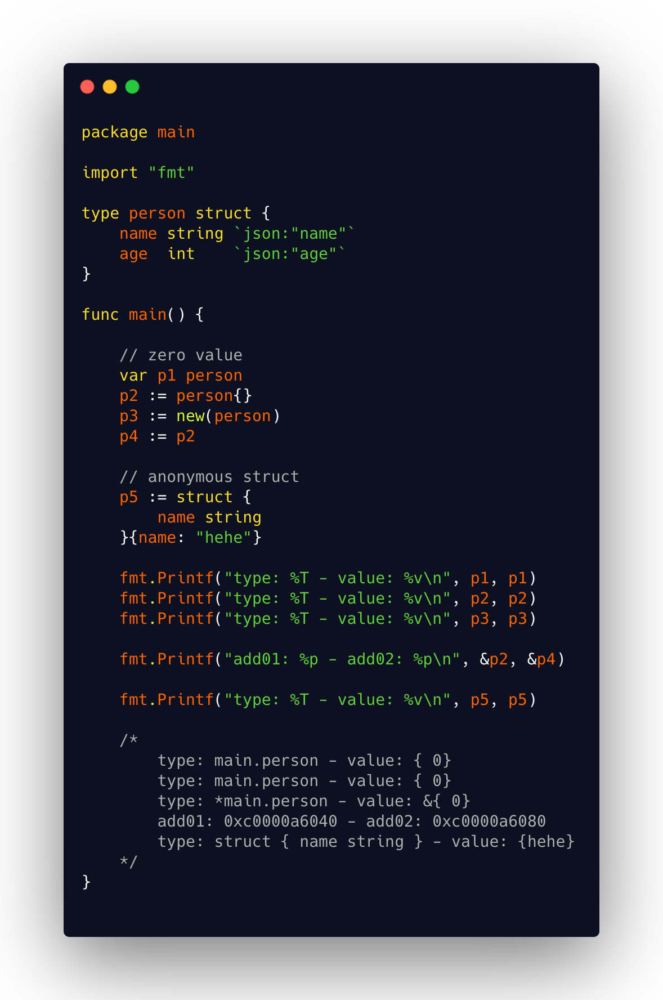
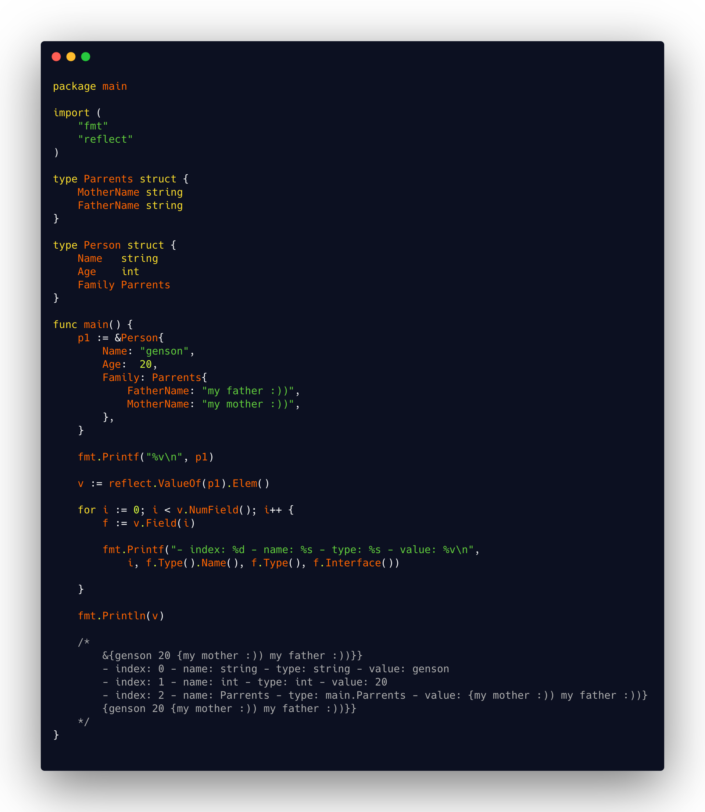

# Struct
- Struct types are a way of creating complex types that group fields of data together. They are a great way of organizing and sharing the different aspects of the data your program consumes.

- A computer architecture’s potential performance is determined predominantly by its word length (the number of bits that can be processed per access) and, more importantly, memory size, or the number of words that it can access.

h1. overview

# Struct method set

### Links
[Padding is hard ](https://dave.cheney.net/2015/10/09/padding-is-hard) - Dave Cheney

[Structure Member Alignment, Padding and Data Packing](https://www.geeksforgeeks.org/structure-member-alignment-padding-and-data-packing/)

[The Lost Art of Structure Packing ](http://www.catb.org/esr/structure-packing/) - Eric S. Raymond